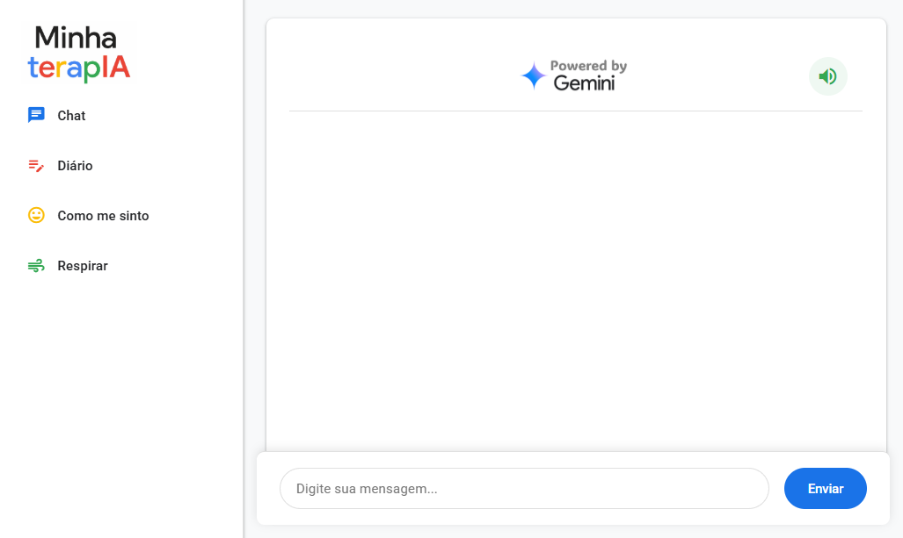
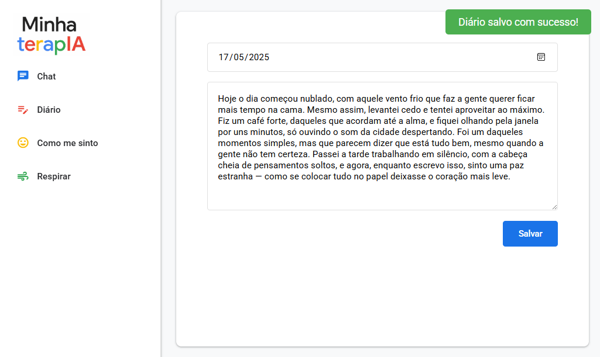
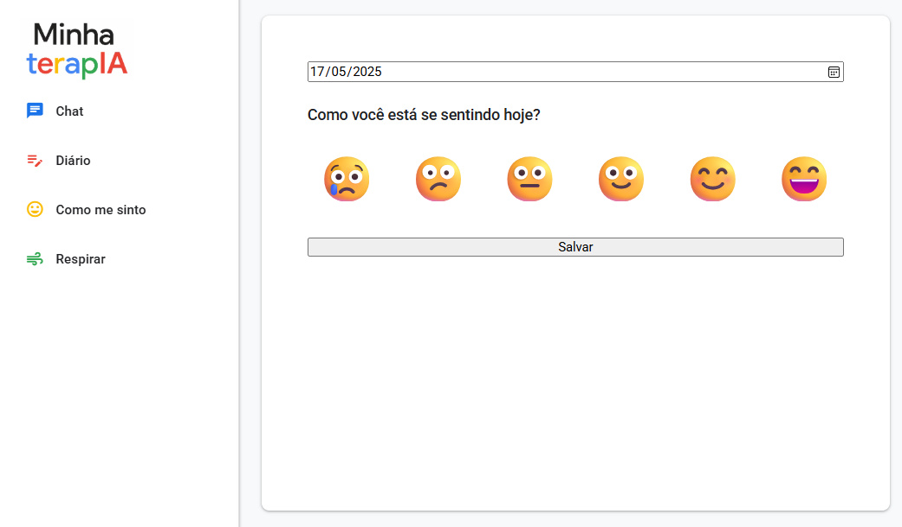
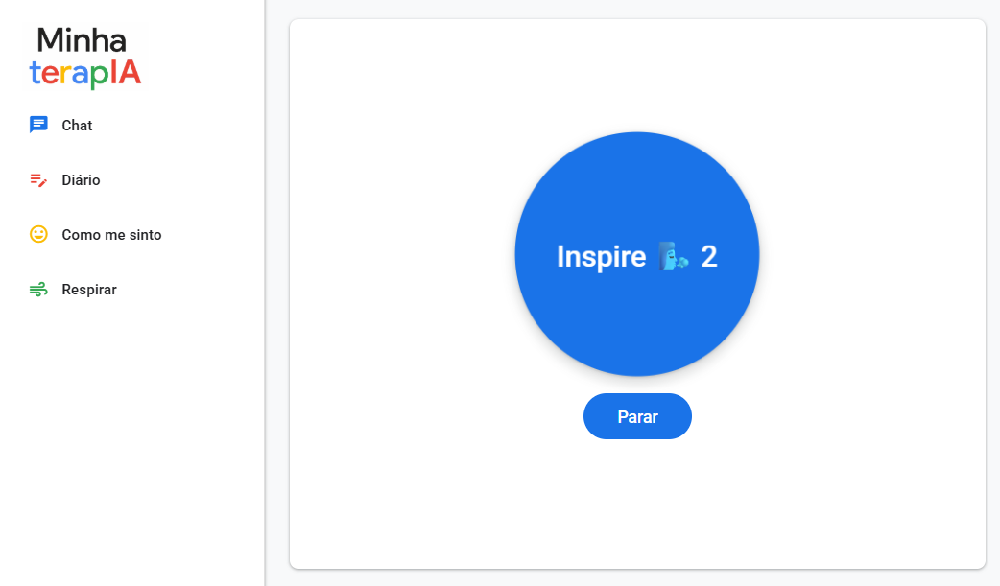

# 🌟 TerapIA - Sua Assistente Emocional Inteligente


<div align="center">
  
  
  *Transformando o cuidado emocional através da tecnologia*
</div>
> 🖱️ Acesse o projeto online aqui: (https://profvictor.github.io/terapIA/)

## 📋 Índice
- [Sobre o Projeto](#-sobre-o-projeto)
- [✨ Funcionalidades](#-funcionalidades)
- [🚀 Tecnologias Utilizadas](#-tecnologias-utilizadas)
- [🎯 Como Usar](#-como-usar)
- [📸 Screenshots](#-screenshots)
- [🛠️ Instalação](#️-instalação)
- [🤝 Como Contribuir](#-como-contribuir)
- [📝 Licença](#-licença)
- [👥 Autores](#-autores)

## 💡 Sobre o Projeto

Utilizando as aulas da imersão da ALura, criei a TerapIA. Uma aplicação web inovadora que combina inteligência artificial com técnicas terapêuticas para oferecer suporte emocional acessível e eficaz. Desenvolvida com foco na experiência do usuário e privacidade, a TerapIA utiliza a poderosa API Gemini para fornecer respostas empáticas e personalizadas, ajudando usuários a gerenciar suas emoções e desenvolver resiliência emocional.

## ✨ Funcionalidades

### 💬 Chat Terapêutico Inteligente
- Interface de chat intuitiva e acolhedora
- Respostas personalizadas usando IA avançada (API Gemini)
- Histórico de conversas preservado para acompanhamento
- Sugestões contextuais baseadas no estado emocional

### 📔 Diário Pessoal Digital
- Registro seguro de pensamentos e sentimentos
- Interface minimalista e focada
- Organização por data e tags
- Exportação de registros (em desenvolvimento)

### 😊 Registro de Sentimentos
- Escala visual de sentimentos (0-5)
- Gráficos de progresso emocional
- Análise de padrões de humor
- Lembretes personalizados

### 🧘‍♀️ Exercícios de Respiração
- Timer visual interativo
- Ciclos personalizáveis de respiração
- Guia de áudio (em desenvolvimento)
- Estatísticas de prática

## 🚀 Tecnologias Utilizadas

- 
- 
- 
- 
- 

## 🎯 Como Usar

1. Acesse a aplicação através do navegador
2. Escolha uma das funcionalidades no menu lateral
3. Interaja com a TerapIA de forma natural e acolhedora
4. Mantenha um registro regular para melhor acompanhamento

## 📸 Screenshots

### 💬 Chat Terapêutico
<div align="center">
  
</div>

### 📔 Diário Pessoal
<div align="center">
  
</div>

### 😊 Registro de Sentimentos
<div align="center">
  
</div>

### 🧘‍♀️ Exercícios de Respiração
<div align="center">
  
</div>


## 🛠️ Instalação

1. Clone o repositório
```bash
git clone https://github.com/seu-usuario/terapia.git
```

2. Navegue até o diretório do projeto
```bash
cd terapia
```

3. Abra o arquivo `index.html` em seu navegador preferido

## 🤝 Como Contribuir

1. Faça um Fork do projeto
2. Crie uma Branch para sua Feature (`git checkout -b feature/AmazingFeature`)
3. Faça o Commit das suas mudanças (`git commit -m 'Add some AmazingFeature'`)
4. Faça o Push para a Branch (`git push origin feature/AmazingFeature`)
5. Abra um Pull Request

## 📝 Licença

Este projeto está sob a licença MIT. Veja o arquivo [LICENSE](LICENSE) para mais detalhes.

## 👥 Autores

- **Victor Costacurta** - *Professor de química* - [profvictor](https://github.com/profvictor)

---

<div align="center">
  <sub>Construído com ❤️ para tornar o cuidado emocional mais acessível</sub>
</div>

---
